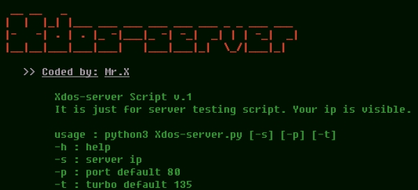

# Xdos-server


## introduction
Xdos-server is a type of DDOS {Distributed Denial of Service} by sending as many bots as possible to flood the server until it goes down 

## Instalations
```
$ pkg update && pkg upgrade -y
$ pkg install python
$ pkg install git
$ git clone https://github.com/Whomrx666/Xdos-server.git
$ cd Xdos-server
$ python Xdos-server.py
```

## Instructions
- **usage**: python3 Xdos-server.py [-s] [-p] [-t]
- **h** : help
- **s** : server ip
- **p** : port default 80
- **t** : turbo default 135

## Observation
This is a tool for education only, I am not responsible for any misuse
### Original Author
<a href="https://github.com/Whomrx666"></a>

### <<< If you copy , Then Give me The Credits >>>

## CONNECT WITH ME :

[](https://whomrxhackers.blogspot.com/)
[](https://twitter.com/whomrx666)
[](https://youtube.com/@whomrx666)
[](https://facebook.com/https://www.facebook.com/whomrx.666)
[](https://t.me/@Whomr_X)
[](mailto:whomrx666@gmail.com)
[](https://www.tiktok.com/@whomr.x)

**If you want to donate, click on the button**
<a href="https://saweria.co/whomrx"></a>

### Visitors :


<h3>Good luck doing ddos</h3>
